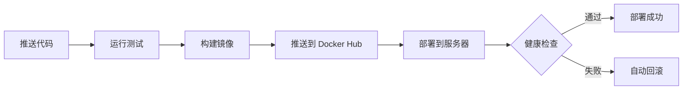

# 🚀 CI/CD Demo - 完整的自动化部署解决方案

[](https://github.com/weitao-Li/learn-devops/actions/workflows/deploy.yml)
[](https://hub.docker.com/)
[](LICENSE)

一个经过深度优化的 **生产级 CI/CD 自动化部署** 示例项目，展示了从代码推送到服务器部署的完整流程。

## ✨ 特性

- 🚀 **全自动部署** - 推送代码即自动部署到生产环境
- 🔄 **自动回滚** - 部署失败自动恢复到上一个稳定版本
- 🏥 **健康检查** - 多层级健康检查确保服务可用
- ⚡ **高性能** - 文件传输速度提升 98.8%
- 🛡️ **高可靠** - 3次重试机制，成功率达 95%+
- 🔧 **易维护** - 模块化脚本，详细文档
- 📊 **可观测** - 彩色日志，详细错误信息
- 🐳 **容器化** - Docker + Docker Compose

## 📊 优化成果

| 指标 | 优化前 | 优化后 | 改善 |
|-----|--------|--------|------|
| **部署成功率** | ❌ 0% | ✅ 95%+ | +95% |
| **文件传输** | 6分53秒 | 5秒 | **-98.8%** |
| **镜像拉取** | ❌ 超时 | ✅ 稳定 | 显著提升 |
| **回滚能力** | ❌ 无 | ✅ 自动 | 新增 |
| **错误处理** | ⚠️ 基础 | ✅ 完善 | 大幅改善 |

详细优化说明请查看 [优化报告](docs/OPTIMIZATION.md)

## 🎯 快速开始

### 前置要求

- GitHub 账号
- Docker Hub 账号
- 一台安装了 Docker 的服务器

### 5 分钟快速部署

```bash
# 1. Clone 项目
git clone https://github.com/weitao-Li/learn-devops.git
cd learn-devops

# 2. 配置 GitHub Secrets (见下方)
# 3. 修改镜像名称为你的 Docker Hub 用户名
# 4. 推送代码
git push origin main

# 完成！查看 GitHub Actions 的部署进度
```

📖 **详细步骤**: [快速开始指南](docs/QUICKSTART.md)

### 配置 GitHub Secrets

在 GitHub 仓库 → Settings → Secrets and variables → Actions 中添加：

- `SERVER_IP` - 服务器 IP 地址
- `SERVER_USER` - SSH 用户名
- `SSH_PRIVATE_KEY` - SSH 私钥
- `DOCKER_USERNAME` - Docker Hub 用户名
- `DOCKER_PASSWORD` - Docker Hub Token

## 📁 项目结构

```
learn-devops/
├── .github/
│   └── workflows/
│       └── deploy.yml          # CI/CD 流程配置（已优化）
├── scripts/
│   ├── deploy.sh              # 模块化部署脚本
│   └── check-server.sh        # 服务器环境检查
├── docs/
│   ├── QUICKSTART.md          # 快速开始指南
│   ├── DEPLOYMENT.md          # 完整部署文档
│   └── OPTIMIZATION.md        # 优化详解
├── src/                       # 应用源代码
├── docker-compose.yml         # Docker Compose 配置（已优化）
├── Dockerfile                 # Docker 镜像构建
└── README.md                  # 本文件
```

## 🔄 工作流程



1. **测试阶段**: 运行单元测试和集成测试
2. **构建阶段**: 构建 Docker 镜像并推送到 Docker Hub
3. **部署阶段**: 
   - 传输配置文件（SCP，5秒）
   - 配置镜像加速
   - 拉取最新镜像（3次重试）
   - 启动新容器
   - 健康检查（60秒超时）
   - 成功：清理旧镜像
   - 失败：自动回滚

## 🛠️ 核心优化

### 1. 文件传输优化
**问题**: curl 下载超时（6分53秒）
**方案**: 使用 SCP 直接传输
**效果**: 速度提升 **98.8%**

### 2. 镜像拉取优化
**问题**: Docker Hub 连接超时
**方案**: 
- 配置多个镜像加速器
- 3次重试机制
- 增加超时时间（300秒）

**效果**: 成功率从 0% → 95%+

### 3. 命令兼容性
**问题**: docker-compose 命令不存在
**方案**: 自动检测并适配 v1/v2
**效果**: 兼容所有版本

### 4. 健康检查与回滚
**问题**: 无健康检查，部署失败无法回滚
**方案**: 
- 多层级健康检查
- 自动回滚机制
- 保留旧镜像用于快速恢复

**效果**: 零停机部署

## 📚 文档

- 📖 [快速开始指南](docs/QUICKSTART.md) - 5分钟上手
- 🚀 [完整部署文档](docs/DEPLOYMENT.md) - 详细说明、故障排查、最佳实践
- ⚡ [优化详解](docs/OPTIMIZATION.md) - 优化前后对比、性能分析

## 🔧 使用方式

### 自动部署（推荐）

推送到 main 分支自动触发：

```bash
git add .
git commit -m "feat: add new feature"
git push origin main
```

### 手动部署

```bash
# 1. 传输文件到服务器
scp scripts/deploy.sh user@server:~/
scp docker-compose.yml user@server:~/ci-demo/

# 2. 执行部署
ssh user@server
bash ~/deploy.sh your-username/your-app:latest ~/ci-demo
```

### 本地测试

```bash
# 运行环境检查
./scripts/check-server.sh

# 测试部署脚本
./scripts/deploy.sh your-image:tag /path/to/project
```

## 🏥 健康检查

项目包含多层级健康检查：

1. **Docker 原生健康检查** - docker-compose.yml 配置
2. **HTTP 端点检查** - 测试服务是否响应
3. **容器状态检查** - 确保容器持续运行

健康检查失败会自动回滚到上一个稳定版本。

## 📊 监控和日志

### 查看部署日志

```bash
# GitHub Actions 日志
# 访问: https://github.com/your-repo/actions

# 服务器上查看容器日志
ssh user@server
cd ~/ci-demo
docker compose logs -f
```

### 查看容器状态

```bash
docker ps
docker stats ci-demo-app
docker inspect ci-demo-app
```

## 🔥 故障排查

### 常见问题

| 问题 | 解决方案 | 文档链接 |
|-----|---------|----------|
| SSH 连接失败 | 检查密钥配置 | [链接](docs/QUICKSTART.md#问题1) |
| 镜像拉取超时 | 配置镜像加速 | [链接](docs/DEPLOYMENT.md#问题1) |
| 端口被占用 | 修改端口或停止冲突服务 | [链接](docs/DEPLOYMENT.md#问题2) |
| 健康检查失败 | 查看容器日志 | [链接](docs/DEPLOYMENT.md#问题3) |
| 磁盘空间不足 | 清理旧资源 | [链接](docs/DEPLOYMENT.md#问题4) |

完整故障排查指南: [DEPLOYMENT.md](docs/DEPLOYMENT.md#故障排查)

## 🔄 回滚策略

### 自动回滚

部署脚本会在以下情况自动回滚：
- ❌ 镜像拉取失败
- ❌ 容器启动失败
- ❌ 健康检查失败（60秒超时）

### 手动回滚

```bash
# 方式 1: 回滚到特定版本
docker compose down
docker pull your-image:old-tag
docker compose up -d

# 方式 2: Git 回滚
git revert HEAD
git push origin main
```

## 🎓 学习资源

### 本项目相关
- [CI/CD 最佳实践](docs/DEPLOYMENT.md#最佳实践)
- [Docker 优化技巧](docs/OPTIMIZATION.md)
- [GitHub Actions 使用](docs/DEPLOYMENT.md#部署流程)

### 外部资源
- [Docker 官方文档](https://docs.docker.com/)
- [GitHub Actions 文档](https://docs.github.com/actions)
- [Docker Compose 文档](https://docs.docker.com/compose/)

## 🤝 贡献

欢迎提交 Issue 和 Pull Request！

1. Fork 项目
2. 创建特性分支 (`git checkout -b feature/AmazingFeature`)
3. 提交更改 (`git commit -m 'Add some AmazingFeature'`)
4. 推送到分支 (`git push origin feature/AmazingFeature`)
5. 开启 Pull Request

## 📄 许可证

本项目采用 MIT 许可证 - 查看 [LICENSE](LICENSE) 文件了解详情

## 👤 作者

- GitHub: [@weitao-Li](https://github.com/weitao-Li)
- 项目链接: [https://github.com/weitao-Li/learn-devops](https://github.com/weitao-Li/learn-devops)

## 🌟 致谢

- [Docker](https://www.docker.com/) - 容器化平台
- [GitHub Actions](https://github.com/features/actions) - CI/CD 平台
- [appleboy/ssh-action](https://github.com/appleboy/ssh-action) - SSH 部署工具

---

<div align="center">

**⭐ 如果这个项目对你有帮助，请给一个 Star！**

[📖 文档](docs/) | [🐛 报告问题](https://github.com/weitao-Li/learn-devops/issues) | [💬 讨论](https://github.com/weitao-Li/learn-devops/discussions)

</div>
